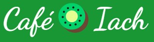
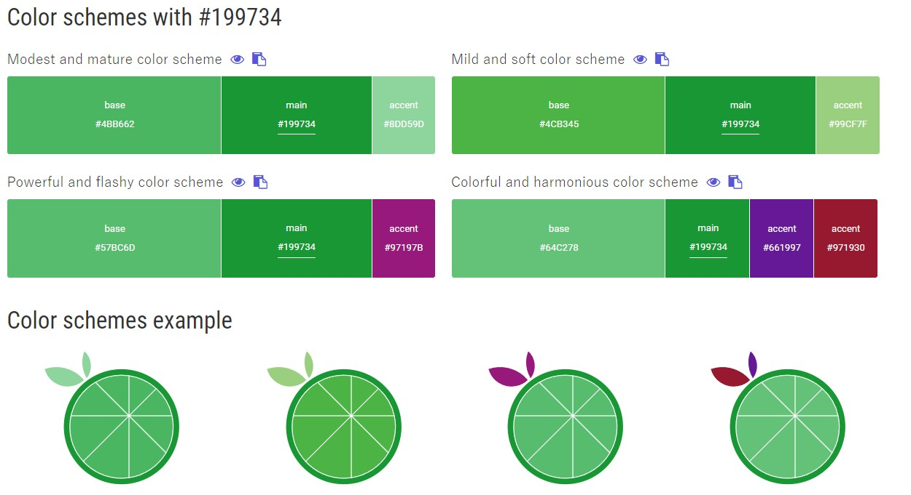

<h2><u>User Centric Frontend Development Milestone Project</u></h2>

Café Iach is fictional business, made up for the purposes of this assignment project. The concept is a small family-run business based in the heart of Cardiff. "Iach" is the Welsh word for "health", or "healthy", and the aim of the business is to offer an alternative to the usual greasy spoon type Café which is usually found in the UK.  The venue hosts live music events once a month.

 

The purpose of the website is to -
<li>Market the business, and inform customers and potential customers of the services on offer.</li>
<li>Allow customers to book via a booking page.</li>
<li>Advertise the services available, such as the food, but also the live music events.</li>
<li>Present a dynamic and engaging website to the public, which includes pictures and videos.</li>
<li>Present a responsive site, which will work on all screen-sizes.</li>
<li>Market the unique selling point of the (fictional) business. The main USP would be the health-benefits of the food and drink being served at the cafe.</li>

 

<h2>Inspiration and ideas</h2>

Completing the "Love Running" project with Code Institute naturally provided me with a range of possible ideas for this website, most notable of which was the banner image with animation on the home page section. The inspiration behind the title comes from "Cafe Bach" (Small cafe) which is based in Aberystwyth University.

A full list of sites that I used for coding ideas is included within the table below. 

 

<table>
      <thead>
        <tr>
          <th>Website Content</th>
          <th>Site for code/inspiration</th>
          <th>Hyperlink</th>
        </tr>
      </thead>

<tbody>
        <tr>
          <td>Bootstrap Navbar</td>
          <td>Get bootstrap</td>
          <td>https://getbootstrap.com/docs/4.0/components/navbar/</td>
        </tr>

<tr> 
          <td>Hero Image</td>
          <td>w3schools</td>
          <td>https://www.w3schools.com/howto/howto_css_hero_image.asp</td>
    </tr>

<tr> 
          <td>Creating Forms</td>
          <td>w3schools</td>
          <td>https://www.w3schools.com/html/html_forms.asp</td>
    </tr>

<tr> 
          <td>Footer</td>
          <td>Inspired by "Code running" work with CI</td>
          <td></td>
    </tr>

<tr> 
          <td>Boostrap row -  justify content-center (for use with footer)</td>
          <td>Stack Overflow</td>
          <td>https://stackoverflow.com/questions/13462535/center-contents-of-bootstrap-row-container</td>
    </tr>

<tr> 
          <td>Create a hamburger responsive menu with CSS only</td>
          <td>Code-boxx</td>
          <td>https://code-boxx.com/simple-responsive-pure-css-hamburger-menu/</td>
    </tr>

<tr> 
          <td>Centre align text to images</td>
          <td>w3schools</td>
          <td>https://www.w3schools.com/howto/howto_css_image_text.asp</td>
    </tr>

<tr> 
          <td>Underline hover for menu options </td>
          <td>stackoverflow</td>
          <td>https://stackoverflow.com/questions/22674633/text-that-shows-an-underline-on-hover</td>
    </tr>

</tbody>

</table>

 

<h2>Technologies Used</h2>
<li>HTML5
<li>CSS3
<li>Bootstrap Version 4.3 - used for responsive layout
<li>Fontawesome v v5.0.10 - for font symbols.</li>

 

<h2>Pages and sections</h2>
<li>On all pages is a Header menu and consistent footer section with Opening Times, Locations, a responsive picture and social media links.</li>
<li>Home Page - inc banner image, video, "About Us" information section and Reviews section.</li>
<li>Book a table - Inc responsive design form.</li>
<li>Live Music - inc a tabulated list of upcoming live music events in 2022, with pictures.</li>
<li>Menus, inc a list of three menus within picture display.</li>

 

<h2>Colour scheme, logo and font</h2>

To ensure a consistent colour pallet, I used colorate to create a colour scheme. My primary colour is a green #199734, which is the colour used for the logo and footer, as well as the menu formatting. Colorate provided a list of possible colours to complement this primary colour.

[Link to colorate site - colour scheme for #199734](https://colorate.azurewebsites.net/Color/199734)

I used Google fonts as part of this project - my two main fonts being "Open Sans" and "Dancing Script." I made sure to use Arial as a back up font. Dancing Script was the font used for the logo "Cafe Iach."

Another coding add-on includes fontawesome, which provided useful symbols and icons, e.g. menu download icons.
As part of the main logo, I used an emoji of a kiwi fruit (https://emojipedia.org/kiwi-fruit/).

 

<h2>Responsive Design and layout</h2>

Ensuring the layout was responsive to various screen-sizes was an important factor throughout. I constantly use the inspect element on Chrome in order to analyse the design and layout from different screen-sizes.

Bootstrap gridline systems was an important element of my design throught. I also used @media scren via CSS for min and max width screen sizes when bootstrap wasn't sufficient by itself.

I spent some time researching hamburger-type menu options for the navbar for smaller screen-sizes. Again, bootstrap was a useful tool here, with simple coding ideas for this online.

For the Flower and reserved image on the “Book a table” page, I spent a lot of time trying to create a responsive design to this banner section. My original aim was for one image to disappear when the screen size was reduced, but failed to find a workaround solution using bootstrap columns only. In the end I found a way for both images to sit on top of each other on reduced screen sizes, though I did reduce the height of the images so that they didn’t take up too mush room on any type of screen.

 
<h2>Using code validation Other various problems and challenges</h2>

Use of W3C validator to check and correct issues, with both HTML and CSS.

 

<h2>Other various problems and challenges</h2>
Due to time constraints I wasn't able to complete the site as to how I originally envisaged it on my wireframe. For example, I had to drop the "News" site, which would have required a lot more work to make a cohesive and unique page to complement the other pages.

<h2>Other documents</h2>

 
Original Wireframe

